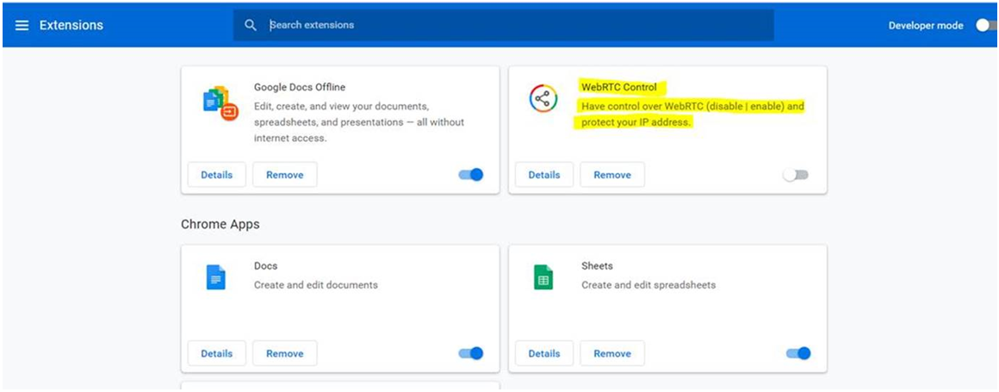

# Public User Troubleshooting

Before using OneConsultation for the first time, we recommend making a test call using the button provided on the virtual waiting room. This will help determine the quality of your connection. 
If you experience issues during the test call, the problem is likely to be internet connection / device related. 
If your test call is fine, but you then experience issues on your real virtual consultation, please let your consultant know - as the problem may be on their side. 

Here are some basic tips for troubleshooting common issues with OneConsultation: 

## I cannot access the consultation

Things to check: 
 * The URL spelling is correct
 * Your device is connected to the Internet
  * If your device is connected to wifi - try 4G instead. In some areas 4G provides a better internet connection than wifi. 
 * The microphone and camera on your device are enabled 
 * You are using a supported device/browser. You can find a list of these [here](browsers.md). Using Chrome on an IOS device will result in the OneConsultation webpage constantly trying to load without success. 

## The audio/video quality of my consultation is poor (video is freezing, sound is dropping out etc)

Please check your Internet connection. 

A wired connection is recommended wherever possible. If a wired connection is unavailable, try to use a good wifi connection. Avoid wifi in public spaces that is shared among lots of people. 

If you're using your home wifi, keep close to the router if you can, and check that nobody else in the house is using your  wifi to stream games or tv/film at the same time as your consultation. Also, check the number of devices connected to your wifi, as connected devices consume bandwidth. 

If your wifi connection is poor or not available, a minimum of 4G is required. 
Please also check that you are using a supported device/browser - you can find this list [here](browsers.md). 

If video is not vital to your consultation, try turning off your camera and continuing the consultation using audio-only. (Video consumes more of your internet bandwidth, so turning it off may improve the audio quality.)

## The consultation has started but I cannot see any video

Check that your consultant has their camera enabled. 

## The consultation has started but I cannot hear any audio

Check that your device audio is enabled. 

## The consultation has started but the consultant cannot see my video / hear my audio 

Things to check: 
* Your device camera and microphone are both enabled 
* Your device isn't muted 

## I've received Error Message 4 when trying to connect to the OneConsultation service

This error code means that the web browser doesn't have access to use the camera and microphone. Please refresh the page, and when prompted, allow OneConsultation to access your device's camera and microphone. 
If you are not prompted to allow access when you refresh the page, go to the browser settings on your device and allow access there. 

## I'm using Chrome but still can't connect to OneConsultation 

Check whether a Chrome extension called WebRTC Control is turned on - if so, this may be causing your issue. Turn off the extension and try again. 

