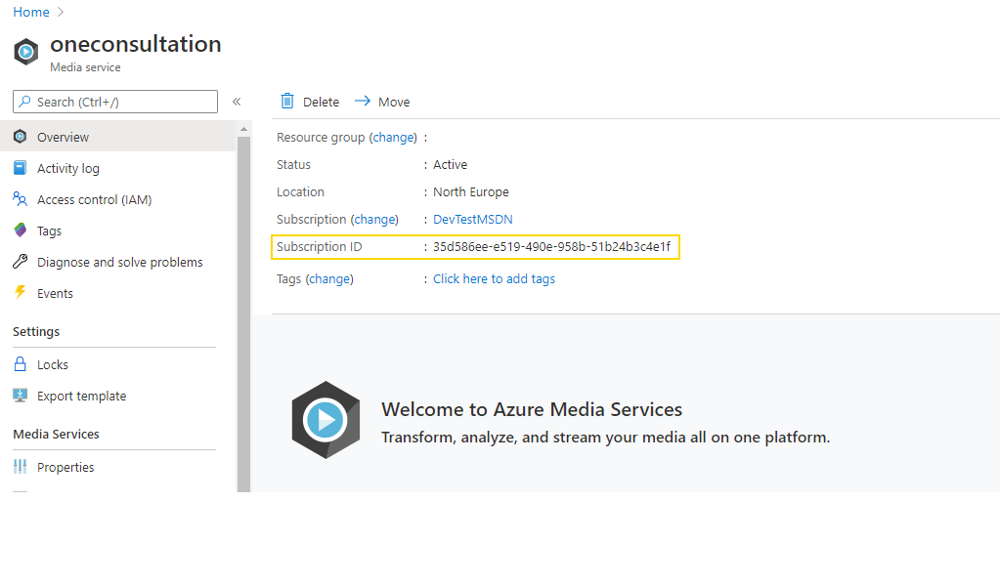
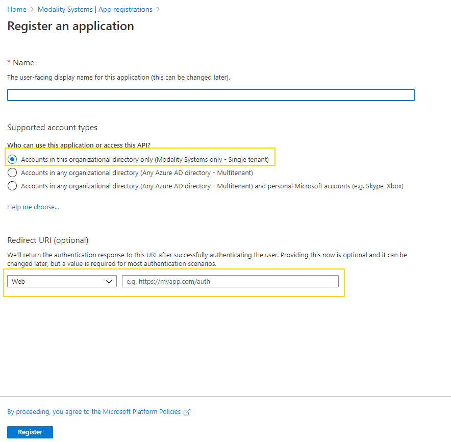
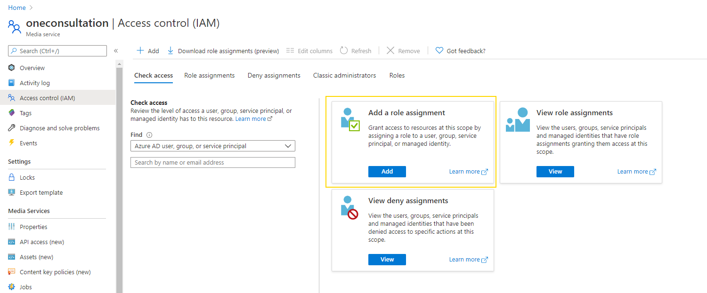

# Setting up OneConsultation Recording

## Introduction

Recording in OneConsultation is an additional feature which can be enabled on a per-room basis as required. Recording is started on-demand via the Admin Portal, and uses an additional concurrency license. Recording processing and storage happens in the your own tenant and therefore requires additional setup before it can be enabled.

Processing and storing video consumes Azure resource. Because recording processing and storage happens in your tenant, you are responsible for these costs. You can use the [Azure Pricing Calculator template](https://azure.com/e/19775a2a6ec843218a9b6c526ab1dc69) to calculate an approximation of costs. (Note that Part 2 of the cost calculation includes a 6x multipler, so for 10 hours of video, use a value of 60).

## Set up

Follow the setup steps below, collating the following information which should be provided to Modality Systems in order to complete onboarding and enable recording. We recommend copying the table below and using it as a template during the remainder of the set up steps.

| Description | Value |
| ------------- |:-------------:|
| Your Azure Tenant ID | 
| Azure Media Services Subscription ID | 
| Azure Media Services Name | 
| Azure Media Services Location |
| Azure Media Services Resource Group |
| Storage Account Name | 
| Application ID | 
| Directory (tenant) ID |
| Application Secret |

### Step 1 - Create Azure Media Services instance

Navigate to the Azure Portal and create a new ["Media Services"](https://portal.azure.com/#create/Microsoft.MediaService) instance. As part of the creation create a new Storage Account or link to an existing storage account. *The storage account should be created in the same location as the Azure Media Services instance*.

Make a note of the Resource Group where the Azure Media Services instance is located, it's name and the Location it is being created in. Make a note of the name of the Storage Account.

Once the Azure Media Services instance has been created, navigate to it, and make a note of the Subscription ID (shown at the top of the Overview tab).

### Step 2 - Create an Azure Active Directory App Registration

Navigate to the Azure Portal and create a new ["Azure Active Directory App Registration"](https://portal.azure.com/#blade/Microsoft_AAD_IAM/ActiveDirectoryMenuBlade/RegisteredApps).

Make sure that the *Supported account types* section is set to "Accounts in this organizational directory only" and that *Redirect URI* is set to Web and left empty.

Once the Registration has been created, navigate to it, and make a note of the Application ID, and Directory (tenant) ID.

Navigate to the *Certificates & secrets* tab and create a new Client secret. Make a note of the secret value.

### Step 3 - Assign Security Access

Navigate back to the Azure Media Services instance. Choose   the *Access control (IAM)* tab.

Click *Add a role assignment*. Choose a Role of "Contributor" and find the name of the application created in Step 2. Click Save.

## Post Setup

Once the setup is complete, securely provide Modality Systems with the information in the table. Your account representative will be able to provide information on how to do this.

Once validation has been completed, on-demand recording will be enabled for one or more rooms. Recording assets will stream to, and be processed in, your tenant.

