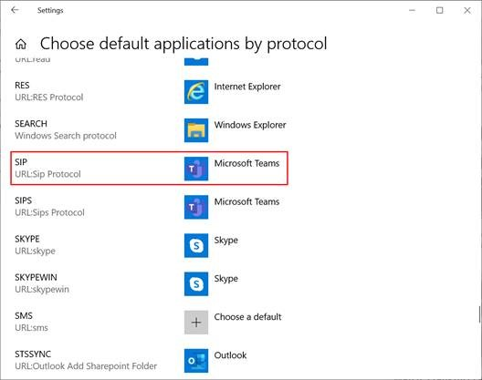
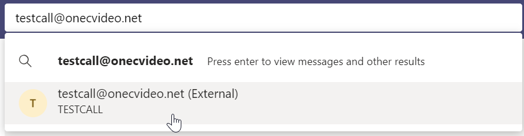

# Microsoft Teams Users – OneConsultation initial setup
 
For O365 users using OneConsultation for the first time, please follow the below setup steps before your first consultation.  
Once this setup is complete, the join experience will be seamless for future consultations.
 
## Step 1 - Set Teams as the default application for SIP: links
 
If using Windows 10:
 
Go to the Windows start menu and type in Choose default applications by protocol and press enter.
 
Scroll down to the SIP: protocol and ensure Microsoft Teams is the program selected:

 
## Step 2 - Ensure Teams is aware of the onecvideo.net environment which hosts OneConsultation.
 
Open Microsoft Teams.
 
In the search bar at the top of teams, type in testcall@onecvideo.net and click on the Search testcall@onecvideo.net externally option that appears:

 
Then, click on the testcall@onecvideo.net contact, and then click on the video button to make a test call:

 
Once these two steps are complete, sign in to https://admin.oneconsultation.net to start using OneConsultation.
